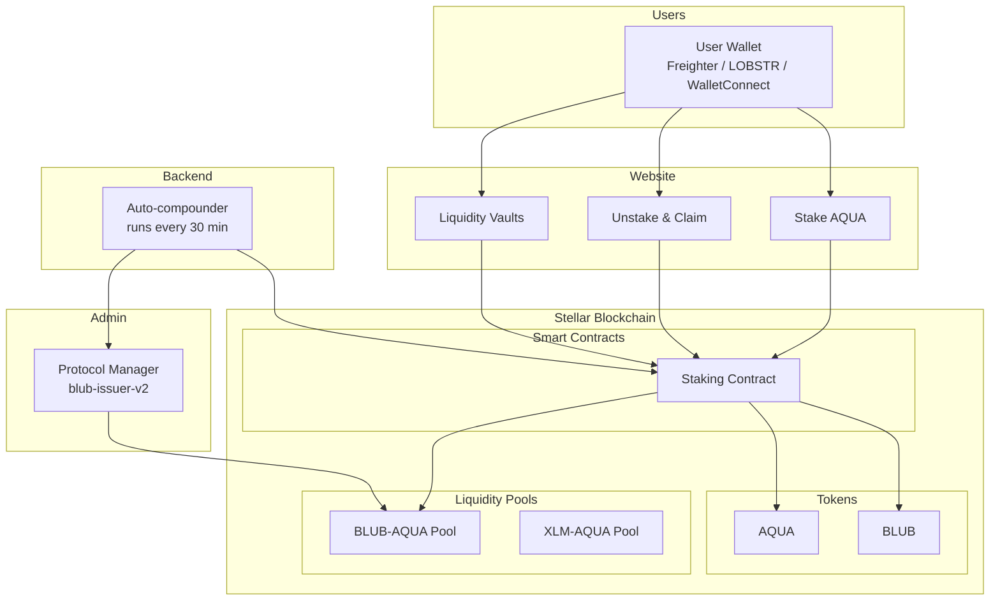

# How It Works

Whalehub connects users, smart contracts, liquidity pools, and a backend automation server into a single yield-generating system.

> **Status (14 September 2026):** staker rewards are active and paid in **AQUA** — v3 went live on mainnet on this date. Whalehub votes its pooled ICE on the **highest-yielding Aquarius market** and routes the voting revenue to stakers as AQUA — see [Reward Distribution](../tokenomics/reward-distribution.md). v2 bought BLUB on the open market to pay stakers; v3 does not, because the revenue already arrives as AQUA. The legacy POL pool-emissions leg (BLUB-AQUA) is paused pending Aquarius re-whitelisting and resumes automatically if approved — but it is no longer required for rewards.

## System Overview

## The Yield Cycle

1. **User locks AQUA** — 90% stays in the contract (queued for ICE governance locking), 10% goes to the admin wallet for liquidity pool deposits
2. **BLUB is minted** — 1.0 BLUB per AQUA locked goes to the user's staking balance, 0.1 BLUB goes to the admin for pool liquidity
3. **Liquidity earns rewards** — AQUA and BLUB deposited into Aquarius AMM pools earn trading fees and AQUA farming rewards
4. **Rewards are distributed** — Every 6 hours the backend splits the voting revenue; the staker half is passed through as AQUA and distributed pro-rata. Nothing is swapped and nothing is minted
5. **User claims AQUA** — Stakers can claim their accumulated AQUA rewards (7-day cooldown between claims). Prefer BLUB? Elect it once and the contract swaps for you at claim time

## Two Ways to Earn

### Staking
Lock AQUA for a chosen duration. Earn AQUA rewards from voting revenue distributed proportionally to all stakers. Longer locks = higher reward multiplier.

### Liquidity Vaults
Deposit token pairs into auto-compounding AMM pools. The backend automatically claims rewards and re-deposits them for you — 4 times a day for BLUB-AQUA, 6 times a day for the other pools — growing your LP position through compound interest.
