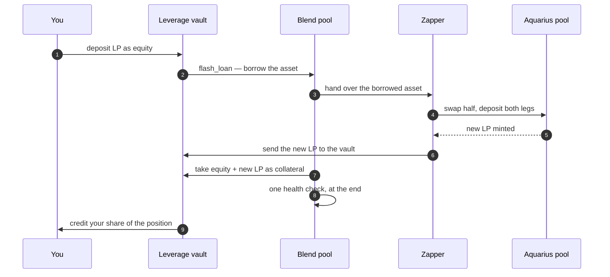

# How Leverage Works

Opening a leveraged position is a single signed transaction. Everything below happens inside it — there is no
moment where you hold a half-built position, and nothing to babysit between steps.

> **Status: testnet preview.** Addresses and flows on this page are live on Stellar testnet only.

## The one-transaction open



Why a flash loan matters: without it, reaching the same leverage means looping
`supply → borrow → swap → supply` several times. Each pass adds less leverage, costs more in fees, and leaves
you liquidatable *between* passes. Blend's flash loan runs the health check **once, at the end**, so the
position is never observably unhealthy while it is being built.

## What protects the transaction

| Guard | Where | What it does |
|---|---|---|
| Leverage cap | Vault | Rejects the open if the requested leverage exceeds the on-chain cap |
| Slippage bounds | Zapper | The swap and the deposit must produce at least the amounts you quoted, or the whole transaction reverts |
| Health check | Blend | The final position must be solvent, or the whole transaction reverts |
| Live quote | Interface | The expected LP output is computed from the pool's current reserves before you sign |

Because all of it is one transaction, a failure anywhere means nothing happened — you keep your LP and pay
only the network fee.

## How your position is tracked

The vault holds one Blend position and records each depositor as **shares** of it. Your position is not
stored as a number; it is calculated from live Blend state every time it is read:

```
your collateral = your collateral shares ÷ all collateral shares × the vault's collateral on Blend
your debt       = your debt shares       ÷ all debt shares       × the vault's debt on Blend
```

This is why interest and liquidation losses spread across depositors automatically, with nothing to
reconcile. It is also the reason for the v1 caveat in
[What Is Leveraged Farming](what-is-leveraged-farming.md#what-you-are-taking-on): losses are shared rather
than isolated.

## Closing a position

Unwinding is `repay + withdraw`, and works partially or in full:

```
You repay part of the debt
└── The vault repays Blend and withdraws that much LP collateral
    └── LP returns to your wallet
        └── Your shares burn in proportion — everyone else's position is untouched
```

In v1 you bring the asset to repay with. A self-closing unwind — flash-borrowing the repayment and settling
it out of the withdrawn LP — is planned.

## If a position goes underwater

Liquidation happens on Blend, not in the vault. When collateral value falls too far against the debt, anyone
can start a Blend auction on the position, and the winning liquidator unwinds it atomically: win the auction,
withdraw the LP through Aquarius into its two assets, swap one leg, repay the borrow.

WhaleHub runs a liquidation bot so auctions clear from day one, and publishes an MIT-licensed reference
liquidator so anyone else can run one too. Neither holds any special permission — a liquidator can only do
what any other participant could do.

The interface shows a live health factor on every open position, with alerts as it approaches the liquidation
boundary.

## Testnet addresses

| Contract | Address |
|---|---|
| Leverage vault | `CC2JF2VP3LVNHYI7URF3R376FCVFSAI4HNVZ2WPZZHBJDAJSWX2X2PFH` |
| Zapper | `CCUDFI62LH2IMHGSRBLLF7SIKRPDQ3LZPA4TYFBFS5ENRYWZOHOKSHT2` |
| Blend pool | `CDSFGJOQ5RHIPK5522VVCNYNOQH4ECGRTPWZK6QBQV4XXA4IAE5BVTW4` |

Both WhaleHub contracts are upgradeable behind stable addresses, so fixes ship without migrating positions.
Full engineering detail, including verification transactions, is in the technical reference.
