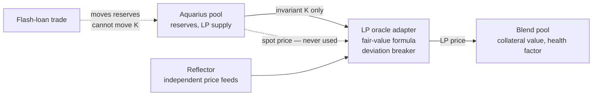

# Oracle and Risk Controls

A lending market that misprices its collateral can be drained. Since the collateral here is an LP share
token — a first-of-kind collateral class on Blend — pricing it correctly is the core safety question.

> **Status: testnet preview.** On testnet the price feed is a mock oracle we control. The production
> adapter described below is the first mainnet deliverable.

## The collateral is never priced by the pool it comes from

The rule is absolute: the LP price never reads the pool's own spot price, or a time-average of it. Instead it
is computed from the pool's **invariant** and independent price feeds from
[Reflector](https://reflector.network):

```
LP price = 2 × √(K × price_A × price_B) ÷ LP supply

where K = reserve_A × reserve_B
```



Why this is safe: an attacker can push a pool's reserves around cheaply with a flash loan, which is exactly
what breaks a spot-priced collateral. Moving `K` is different — it requires depositing real assets and
leaving them behind. So the collateral price cannot be moved by a trade. This is the same fair-value approach
used by Alpha Homora, Curve and Chainlink reference oracles.

If a Reflector feed goes stale or dislocates from the others, a deviation breaker **halts new borrowing**
rather than lending against a bad price. Existing positions are unaffected until the feed recovers.

## Launch parameters

| Parameter | Launch value | Why |
|---|---|---|
| Collateral factor | 0.50 – 0.60 | Conservative for a new collateral class |
| Liquidation boundary | 1.82× | Set by Blend as `1 / (1 − collateral factor × liability factor)` |
| Interface cap | 1.47 – 1.67× | 92% of the boundary — leaves room for a 25–37% adverse move |
| Equity cap, launch pair | ~$450K | The measured capacity of Aquarius XLM/USDC concentrated |
| Backstop | Funded at deployment | Blend requires it before a pool can earn emissions |

The equity cap exists because pool depth is finite: a $1.26M Aquarius pool cannot absorb an unlimited unwind,
and every dollar of new LP also dilutes the rewards the pool pays out. The cap rises as more pairs are added.

## Known risks, stated plainly

| Risk | What happens | What limits it |
|---|---|---|
| **XLM rallies** | Debt grows faster than collateral as the pool rebalances out of XLM — this is the move that liquidates | Leverage capped at 92% of the boundary; live health factor and alerts |
| **XLM falls** | The position gets *safer* — debt shrinks faster than collateral | Nothing needed; the counterpart is a smaller upside in a rally |
| **Borrow rate rises above LP yield** | Leverage starts subtracting return | Live net APY and break-even rate shown before signing; unwind at any time |
| **Shared losses (v1)** | A liquidation is spread across vault depositors, not isolated to one position | Equity cap at launch; per-user isolation before mainnet |
| **Pool depth** | A large unwind moves the Aquarius price against itself | Equity cap sized to measured pool capacity |
| **Contract risk** | Bugs in vault, zapper, oracle or liquidator | External audit before mainnet; slippage bounds and caps enforced on-chain |

## Custody and permissions

Everything settles on-chain. User funds never leave Soroban contracts, and no off-chain component can move
capital. The keeper and liquidation bots only ever *initiate* transactions that anyone else could also send —
they hold no privileged authority. Contract upgrades are admin-gated and, on mainnet, governed by the same
multi-signature process used for the live staking contract.

## Before mainnet

- Production LP oracle adapter with the manipulation test suite.
- Per-user health and per-user liquidation, replacing shared losses.
- On-chain leverage cap lowered to the liquidation boundary.
- Soroban footprint validation of the full liquidation sequence — a liquidation that cannot fit in a
  transaction is an un-liquidatable position.
- Third-party security audit of the vault, zapper, oracle adapter and liquidator, with a published report.

Leveraged positions can be liquidated and can lose more than an unleveraged position. All figures on these
pages are arithmetic outputs of stated assumptions, not projections of return.
