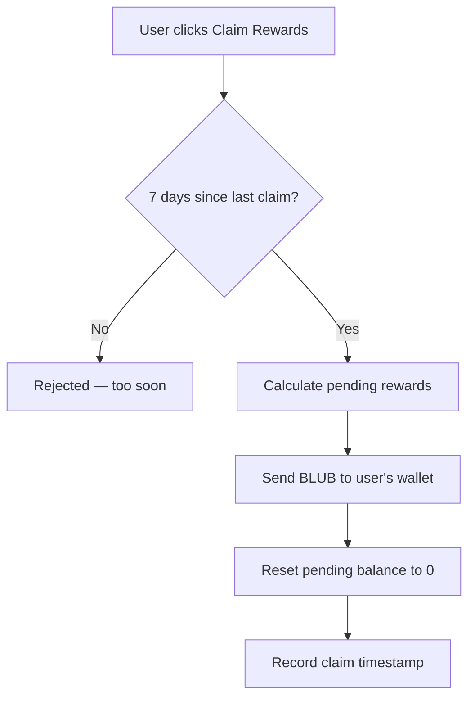

# Claiming Rewards

BLUB rewards accumulate continuously while your tokens are staked. You can claim them every 7 days.

> **Status (2026-06):** BLUB rewards are actively accruing. Staker income now comes from the [Bribes Harvesting Module (v2)](../tokenomics/bribes-harvesting.md), which earns Aquarius bribes by voting Whalehub's ICE on the **highest-yielding market** — replacing the earlier pool-farming source.

## How Claiming Works



## Important Notes

- **Rewards are NOT automatic** — you must claim them manually
- **7-day cooldown** between claims
- **Rewards are separate from unstaking** — withdrawing your locked tokens does NOT automatically send your rewards
- Rewards continue accumulating even if you don't claim them — nothing is lost by waiting

## How Rewards Are Calculated

Whalehub uses the **Synthetix reward model** — rewards are split fairly based on each user's share of the total staked pool.

```
Your pending rewards = Your staked BLUB × (Current reward rate − Your last checkpoint rate)
```

The reward rate increases every time the protocol distributes new BLUB from harvested income. Your share is proportional to how much BLUB you have staked relative to the total.

## Where Do Rewards Come From?

Rewards come from the [Bribes Harvesting Module (v2)](../tokenomics/bribes-harvesting.md). Whalehub votes its ICE on the Aquarius market with the **best bribe yield for our voting power**, and as bribes arrive the backend:

1. Collects the bribe income (AQUA)
2. Sends 30% to the protocol treasury
3. Swaps 70% to BLUB on the open market (non-dilutive — never minted)
4. Distributes that BLUB to all stakers proportionally

> Whalehub continuously re-evaluates every active bribe and re-targets its votes to **optimize for the best yield** each epoch. See the [Bribes Harvesting Module](../tokenomics/bribes-harvesting.md) for the methodology.
