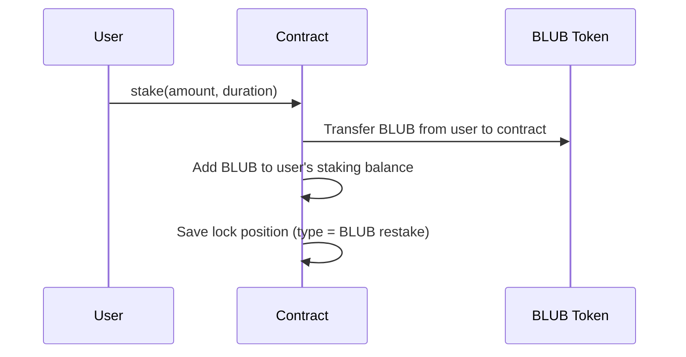

# Restaking BLUB

If you already hold BLUB tokens (from previous rewards or purchases), you can restake them to earn additional rewards without needing new AQUA.

## How Restaking Works

## Key Differences from AQUA Locking

| | AQUA Lock | BLUB Restake |
|---|---|---|
| Token deposited | AQUA | BLUB |
| BLUB minted? | Yes (1.0x + 0.1x) | No — your existing BLUB is locked |
| AQUA sent to pool? | Yes (10%) | No |
| Earns rewards? | Yes | Yes |
| Lock duration | Your choice (min 7 days) | Your choice (min 7 days) |
| Withdrawal cooldown | 10 days | 10 days |
| You get back | Original AQUA | Original BLUB |

## When to Restake

Restaking is useful for compounding your returns. Rewards are paid in AQUA since v3, so the compounding loop is: claim AQUA, lock it to mint BLUB, stake that BLUB. If you elected BLUB payouts instead, you can restake the BLUB directly.
