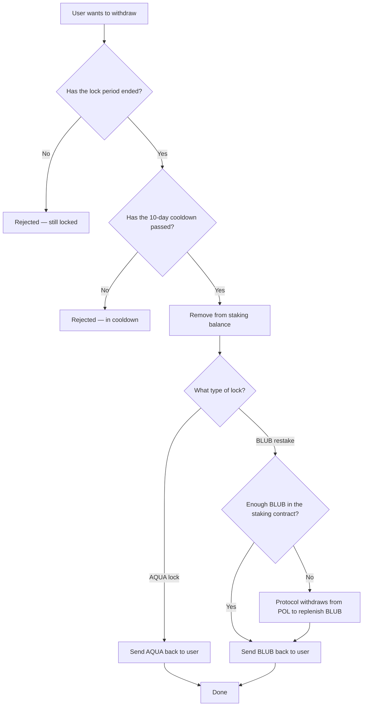

# Unstaking

After your lock period expires and the cooldown passes, you can withdraw your original tokens.

## Withdrawal Process



## Liquidity backing (POL replenishment)

A portion of staked value is held as **Protocol-Owned Liquidity (POL)** in the AQUA/BLUB
pool rather than sitting idle in the staking contract. If the staking contract ever holds
**insufficient BLUB to fulfil a withdrawal**, the protocol will **withdraw from POL** (unwinding
part of the LP position back into AQUA + BLUB) to replenish the staking contract's BLUB balance
as part of the unstaking procedure, so eligible users can withdraw successfully. This is an
administrative step performed via the protocol's multisig and does not change your withdrawable
amount.

## Timeline

```
Day 0          Day 30              Day 40
│── Lock ──────│── 10-day cooldown ─│── Can withdraw ──→
  (locked)       (expired, waiting)    (ready)
```

## Key Points

- **Lock period**: the duration you chose when staking (minimum 7 days)
- **Cooldown**: 10 additional days after the lock expires
- **Partial unstaking**: you can unstake specific lock positions without affecting others
- **Rewards are separate**: unstaking does NOT claim your pending BLUB rewards — use [Claim Rewards](claiming-rewards.md) for that
- **You receive back** the same token type you deposited (AQUA for AQUA locks, BLUB for BLUB restakes)
- **Liquidity-backed**: if the staking contract is short on BLUB, the protocol withdraws from POL to cover your withdrawal (see [Liquidity backing](#liquidity-backing-pol-replenishment) above)
