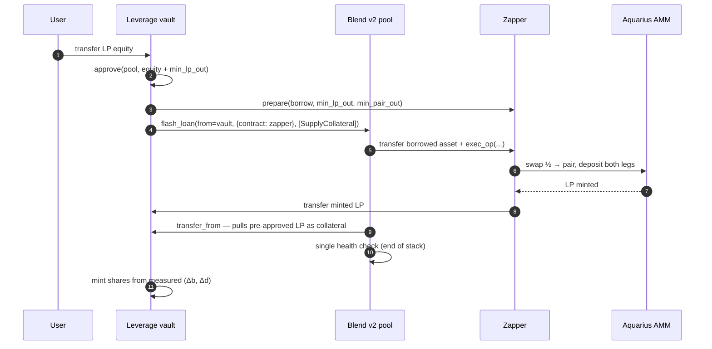
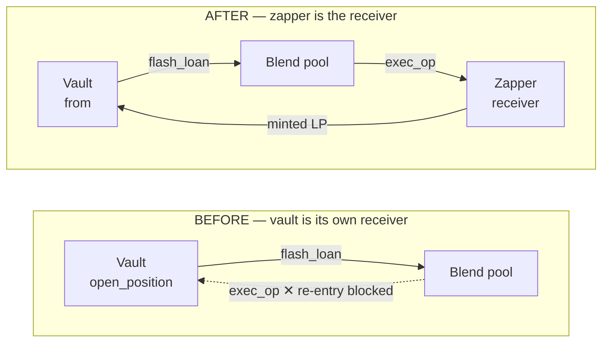
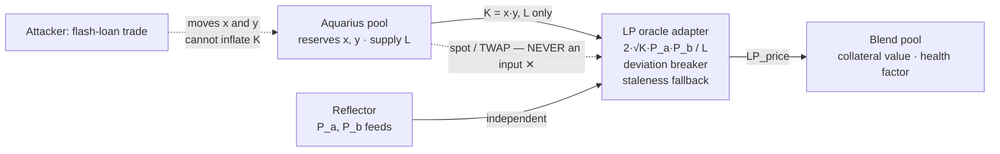

# Leveraged LP Farming on Blend v2

**Status:** end-to-end verified on Stellar testnet; mainnet pending (oracle adapter, audit, backstop).
**Revision:** 2026-08-16 · soroban-sdk 21.7 · Blend v2
**Web version (with diagrams):** https://claude.ai/code/artifact/32d858c5-540e-4419-866b-b3f73cd2b5d9

> Supersedes the 2026-06-27 design note. That version described a *vault-owns-position, vault-is-its-own-
> flash-loan-receiver* architecture, which does not work on Soroban (see [§3](#3-why-two-contracts-and-how-users-are-tracked)).

---

## 1. What the system does

A liquidity provider on Stellar has one lever today: deposit more capital. The LP share token an Aquarius
pool issues is a transferable SEP-41 asset, and Blend v2 runs permissionless pools with a `flash_loan`
primitive — but nothing connects them. The leverage vault is that connection.

A user deposits LP (or equity routed into LP) and picks a target leverage. One transaction later they hold
roughly 1.5× their original LP exposure with a borrow against it, and can unwind at any time, partially or
fully. Without the flash loan the same result is a `supply → borrow → zap → supply` loop: each pass adds
less leverage, costs more fees, and leaves the position liquidatable *between* passes. Blend runs the
health check exactly once, at the end of the request stack, so the position is never observably unhealthy.

| Component | Role | Trust |
| --- | --- | --- |
| **Leverage vault** | Holds the Blend position, mints/burns per-user shares, enforces the leverage cap | Upgradeable, admin-gated; holds all user collateral |
| **Zapper** | Flash-loan receiver: swaps half the borrowed asset, deposits into the AMM, returns minted LP to the vault | Only callable by the pool inside a loan the vault staged |
| **Blend v2 pool** | Flash loan, LP collateral reserve, borrowable reserve, liquidation auctions | Third party (Script3) |
| **AMM (Aquarius)** | Mints the LP share token used as collateral; the unwind venue | Third party; slippage-bounded on every call |
| **LP oracle adapter** | Prices LP collateral from the pool invariant + Reflector feeds | Deviation breaker halts borrowing on a bad feed |

---

## 2. The atomic open

One call to `open_position(user, collateral_lp, borrow_amount, min_lp_out, min_pair_out)` composes a single
Blend `flash_loan` whose request stack does the entire job. The vault is the borrower (`from`); the zapper
is the receiver.



```
open_position
  user.require_auth()
  guard      leverage_bps = (collateral_lp + min_lp_out) / collateral_lp ≤ max_leverage_bps
  snapshot   (b_before, d_before) ← pool.get_positions(vault)      // bToken / dToken
  pull       lp.transfer(user → vault, collateral_lp)
  approve    lp.approve(vault → pool, collateral_lp + min_lp_out, ttl 120 ledgers)
  stage      zapper.prepare(borrow_amount, min_lp_out, min_pair_out)
  execute    pool.flash_loan(vault, {contract: zapper, asset, amount}, [SupplyCollateral])
  settle     (b_after, d_after) ← pool.get_positions(vault)
             mint shares from (Δb, Δd) — the ACTUAL position delta, not the requested one
```

Guards on the path: `leverage_bps ≤ max_leverage_bps` in the vault, `min_lp_out` / `min_pair_out` slippage
bounds in the zapper, and Blend's own health check.

### Blend v2 interface (verified against `blend-contracts-v2` `main`)

```rust
fn flash_loan(e: Env, from: Address, flash_loan: FlashLoan, requests: Vec<Request>) -> Positions;
fn submit(e: Env, from: Address, spender: Address, to: Address, requests: Vec<Request>) -> Positions;

struct FlashLoan { contract: Address, asset: Address, amount: i128 }
struct Request   { request_type: u32, address: Address, amount: i128 }

// RequestType discriminants
// Supply 0 · Withdraw 1 · SupplyCollateral 2 · WithdrawCollateral 3 · Borrow 4 · Repay 5
// FillUserLiquidationAuction 6 · FillBadDebtAuction 7 · FillInterestAuction 8 · DeleteLiquidationAuction 9
```

Execution order inside `flash_loan`: the pool adds the borrowed amount as a **real liability** to `from`,
transfers the asset to `flash_loan.contract`, calls `exec_op(caller, token, amount, fee)` on it, then
processes `requests` for `from` via `handle_transfer_with_allowance` (**transfer_from / allowance**), then
runs the health check once. The allowance step is why the vault pre-approves the pool before the loan.

---

## 3. Why two contracts, and how users are tracked

The first working design made the vault its own flash-loan receiver. It cannot work on Soroban: the vault
is still on the call stack inside `open_position` when the pool calls back into it, and the host rejects the
re-entry with `Error(Context, InvalidAction)` (deepest event: *"Contract re-entry is not allowed"*).
Splitting the receiver into a separate zapper is what makes the pattern legal — the single most reusable
finding from this build for anyone else composing Blend flash loans.



Everything else about the request stack is identical; moving `exec_op` onto a contract that is not already
on the call stack is the entire fix. The zapper holds no user funds and its `exec_op` is guarded by a
transient staging flag set by `prepare`, so it is only callable by the pool inside the loan the vault staged.

### Share-based CDP accounting

The vault owns exactly one Blend position and tracks each depositor as **shares** of it. Nothing about a
user's position is stored as an amount — it is derived, on read, from live Blend state:

```
user_collateral = collateral_shares / total_collateral_shares
                  × pool.get_positions(vault).collateral[lp_reserve_index]

user_debt       = debt_shares / total_debt_shares
                  × pool.get_positions(vault).liabilities[borrow_reserve_index]
```

Interest accrual and liquidation therefore socialise pro-rata with no reconciliation step, no keeper, and no
ledger that can drift out of sync with the pool — an earlier internal-ledger design desynced the moment a
liquidation touched the position. Shares are minted from the measured delta in the vault's bToken/dToken
balances across the flash loan, not from the requested amounts, so slippage and fees land on the depositor
who caused them.

The trade-off is explicit and is the Aave model: **losses are shared across the vault** rather than isolated
to the position that caused them. Acceptable at launch size under an equity cap; not acceptable at scale —
per-user health and per-user liquidation is scheduled work, not a design position.

**What "pooled" does and does not mean.** These two statements are easy to read as contradictory, so they
are stated together deliberately:

| Event | Who bears it |
| --- | --- |
| A depositor **voluntarily unwinds** | Only them. Shares burn from the measured position delta, so the exit takes exactly their share and every other depositor's claim is unchanged. |
| A depositor's position is **liquidated** | **Everyone, pro-rata.** The penalty lands on the vault's single Blend position, so every share loses value — including shares belonging to depositors who were never over-levered. |

There is one position on Blend and one share price derived from it. That is what makes accounting exact
under interest and liquidation, and it is exactly why a liquidation cannot be contained to the depositor
who caused it. **v1 does not isolate liquidation losses, and nothing in this document should be read as
claiming it does.** The equity cap is the mitigation until isolation ships.

Two designs would give real isolation, and the choice is open:

- **User-owned Blend positions** — the user is Blend's `from` and the vault is only the flash-loan
  receiver. Isolation is then structural, at the cost of a more complex client and per-user
  authorisation. This was considered and set aside for v1; it is the cheapest route to a correct claim.
- **A per-user sub-account model** inside the vault, which needs a separate Blend position per depositor
  and is materially heavier than v1's share ledger.

Views: `get_position(user)` (derived live), `get_user_shares`, `get_totals`, `get_share_totals`,
`get_blend_positions`, `get_config`.

---

## 4. Unwind and liquidation

**User unwind.** `repay_and_withdraw(user, repay, withdraw_lp, min_lp_out)` submits a plain (non-flash) Blend
request pair: `Repay` then `WithdrawCollateral`. The pool pulls the repay amount by `transfer` with the vault
as *spender*, which an allowance does not satisfy — the vault authorises that sub-invocation with
`authorize_as_current_contract` (`ContractContext` fn_name `"transfer"`, args `(vault, pool, repay_amount)`;
the same pattern as `deposit_pol_to_lp` in the staking contract). Shares burn from the measured position
delta, so a **voluntary** exit takes exactly the leaver's share and leaves every other depositor's claim
unchanged. (This holds for unwind only — a *liquidation* is shared across the vault; see §3.) Partial
unwinds are supported; v1 requires the user to bring the
repay asset, and a flash-loan self-closing path is scheduled.

**Liquidation** happens at the Blend level against the vault's position: a keeper calls `new_auction`, and the
winning filler unwinds atomically in four steps inside one Soroban transaction — win the auction, withdraw
the LP through Aquarius into its two assets, swap one leg, repay the borrow. The vault exposes
`clear_auction()` (submits `DeleteLiquidationAuction` with `from = vault`) so it can delete a stale auction on
itself. The reference liquidator is published MIT-licensed so any future LP-collateral market on Blend can
fork the four-step unwind rather than rebuild it.

---

## 5. Pricing the LP collateral

This is the part of the design that can drain a lending pool if it is wrong, so the rule is absolute: the
collateral price never reads the pool's own spot price or a TWAP of it. The LP token is priced from the pool
**invariant** and independent Reflector feeds — the fair-value formula used by Alpha Homora, Curve and
Chainlink reference oracles. For a constant-product pool with reserves `x`, `y` and LP supply `L`:

```
LP_price = 2 · √(K · P_a · P_b) / L        where K = x · y
```



Pool state enters **only** through the invariant. An attacker can shove reserves around cheaply, which is
what breaks a spot-priced LP collateral; moving `K` requires depositing real assets and leaving them, so the
collateral price is not tradeable. If a feed goes stale or dislocates, the breaker halts new borrowing rather
than lending against a bad price.

> **Failure mode found on testnet — worth publishing.** When the oracle's price entries expire under Soroban
> state TTL, *every* vault entrypoint reverts and nothing in the trace names the oracle: the flash loan and
> the collateral supply both succeed, then `lastprice` returns `Void` and the run ends in
> `VM call trapped: UnreachableCodeReached`. Blend defines `PoolError::InvalidPrice = 1210`, but a *missing*
> price surfaces as an untyped host trap instead, so the symptom looks like a vault or zapper bug. Any
> integrator hitting a blanket revert should check price freshness first.

---

## 6. Fees

The protocol charges one fee: **10% of net profit after borrow costs**, measured against a per-share
high-water mark. No management fee, no deposit fee, no withdrawal fee.

The structure follows from the economics. Leverage at 1.55× earns the user roughly 3–4 percentage points
over plain liquidity provision, so a fee levied on principal or on gross yield would consume the entire
reason to use the product. A fee charged only on profit above a high-water mark earns nothing in a
drawdown, nothing while a position recovers, and cannot invert the user's edge.

**How it accrues**

- **Net of borrow costs** — profit is measured after interest paid on the Blend debt, not on gross LP yield.
- **Per-share high-water mark** — a share that has fallen in value pays nothing until it exceeds its
  previous peak, so the same gain is never charged twice.
- **Computed from live Blend state**, the same source as every other position figure, so the fee cannot be
  derived from a stale internal ledger.
- ⚠️ **Not yet implemented.** The testnet vault charges no fee; the fee module lands with per-user health
  accounting as a mainnet deliverable.

**Where it goes.** 30% of the fee collected is routed to the BLUB-AQUA pool: the AQUA leg acquires BLUB and
the result is added as two-sided liquidity, which stays protocol-owned. This is pool depth, not a buyback —
the leverage product generates fees and those fees deepen the pool that anchors the AQUA staking and BLUB
vault already live on mainnet. At $1M of vault equity the routed share is roughly $4,700/yr; $18,300 at $5M.

**Revenue and the cost of the fee.** The fee reduces capacity as well as producing revenue, so the product
is sized on the fee-adjusted figure: equity capacity ≈ **0.25× the underlying Aquarius pool TVL at a 10%
fee**, against 0.35× at zero fee. Assuming the multi-pair vaults have shipped and equity spreads pro-rata
across gauge-enabled Aquarius TVL of $21.4M, at 1.55×, unboosted, on the rates of 12 Aug 2026:

| Equity (TVL) | LP exposure | Net APY | User net after fee | Edge vs plain LP | Protocol revenue / yr |
| ---: | ---: | ---: | ---: | ---: | ---: |
| $500K | $775K | 16.06% | 14.45% | +3.68 pp | $8,000 |
| $1M | $1.55M | 15.51% | 13.96% | +3.19 pp | $15,500 |
| $2M | $3.10M | 14.53% | 13.07% | +2.30 pp | $29,100 |
| $3M | $4.65M | 13.66% | 12.29% | +1.52 pp | $41,000 |
| $5M | $7.75M | 12.20% | 10.98% | +0.21 pp | $61,000 |

At $5M the edge over plain liquidity provision has compressed to 0.21 pp — the unboosted ceiling of the
current gauge set. Growth past that point requires new Aquarius depth, not more deposits.

---

## 7. Deployed testnet stack

Aquarius pools are mainnet-only, and Blend testnet pools cannot borrow until their backstop clears the
protocol threshold, so the full environment was deployed and funded from scratch: a minimal
Aquarius-interface AMM that is its own LP share token, two issued test assets, a price oracle, a Blend pool,
and a self-funded backstop.

| Contract | Address | Notes |
| --- | --- | --- |
| **Leverage vault** | `CC2JF2VP3LVNHYI7URF3R376FCVFSAI4HNVZ2WPZZHBJDAJSWX2X2PFH` | Upgradeable; address stable since 2026-06-28 |
| **Zapper** | `CCUDFI62LH2IMHGSRBLLF7SIKRPDQ3LZPA4TYFBFS5ENRYWZOHOKSHT2` | Flash-loan receiver, pinned to the vault |
| Blend v2 pool | `CDSFGJOQ5RHIPK5522VVCNYNOQH4ECGRTPWZK6QBQV4XXA4IAE5BVTW4` | Status 0 (active); LP idx 0, borrow idx 1 |
| Price oracle | `CCBQAAFHTGG6EUPB4SXBJNHAYVVEB746E4RNPOG55MV77NNYLJZRMIUK` | Mock, 7 dp; stands in for Reflector + LP adapter |
| AMM / LP token | `CDOTVNSYEFF6TWAFSMO3AVSHYEMTMAWTR2E7GXUOOLOCSEC6UV6KJWGC` | Constant product; the pair *is* its LP token |
| Borrow asset (TUSDC) | `CA2AYW5YFEI36LY5L7NTDN666KMR7SBCY4MLY6FA6UMAYBF3ZS7PR7WH` | SAC, issued by the deployer |
| Pair asset (TAQUA) | `CAMP6O2ZGMY65DDCJKC7RGZVSOWTFHQDHG6MHD2BRZXBUQBIYNQJMCUJ` | SAC, issued by the deployer |
| Deployer | `GBKXWIGUB2QNCF4HTUMDMZTCA5JHUVJ7KKYJKJ4D23DJJMZUSUOW5BQD` | Testnet-only key; no production key was used |

A second market (XLM/USDC — AMM `CAKZSBUEJCDXO7D5BFXPIY6NBVBUONHJ7RSFNK6R4C7SNKST7Y5FHQHC`, vault
`CB7PYSZRGKRRCYXYDQ7WKIWOK5WLKXKN4FWK3XL5NDHT3WFY622XVSEH`, zapper
`CCWJ5FW5ZU6WSCFL4FO4TNAK3Q6G63WUILNIBOR26RRLNQBVUUUO7VHT`, `lp_reserve_index = 2`) is deployed and wired into
the interface but not yet borrowable: Blend imposes a **one-week timelock** on adding a reserve to a pool that
has left setup, and `set_reserve` returns `#1203 InitNotUnlocked` until it elapses. Reserves configured during
setup have no delay, which is why the first market went live immediately. The frontend shows such markets as
*activating* and disables opening.

**Backstop activation.** A Blend pool cannot enable borrowing until its backstop clears
`bal_blnd⁴ × bal_usdc ≥ 1e25` on the underlying of its backstop shares. The testnet faucet caps out around
$400 per account, so the threshold was reached by farming ~34 throwaway accounts into ~180k BLND and ~27k
USDC, joining the Comet BLND:USDC pool, depositing the resulting LP to the backstop, and calling
`set_status(0)`. On mainnet the same threshold resolves to a single point on the Comet 80/20 ratio:
**247,464 BLND + 2,667 USDC**.

### Parameters — testnet versus mainnet

| Parameter | Testnet | Mainnet target | Consequence |
| --- | ---: | ---: | --- |
| LP collateral factor | 0.90 | 0.50–0.60 | Conservative for a first-of-kind collateral class |
| Borrow liability factor | 0.95 | 0.75 (XLM) | Blend's own reserve parameter |
| Liquidation boundary `1/(1 − c·l)` | 6.90× | 1.82× | The hard ceiling Blend enforces |
| Interface cap (92% of boundary) | — | 1.67× | Leaves room for a 25–37% adverse move |
| Vault `max_leverage_bps` | 3.00× | 1.67× | ⚠️ **to fix** — currently above the mainnet boundary |

The testnet parameters are permissive precisely so the mechanism can be exercised; they are not a proposal.
Because the vault cap (3.00×) sits above the mainnet boundary (1.82×), the vault would today wave through
positions Blend then refuses — correcting the cap is an explicit deliverable, and a mainnet-parameter
simulation is queued behind the same reserve timelock.

---

## 8. Testing and verification

Confidence in this build rests primarily on live transactions, not on unit tests. Every claim below is a
transaction on Stellar testnet that can be pulled from Horizon and re-read.

| What was tested | Result | Evidence |
| --- | --- | --- |
| **Atomic leveraged open** ✅ | 100 LP equity + 100 borrowed → collateral `990,000,000` → `2,485,000,000`, debt → `1,499,926,519` (**1.495×**) | `5e7a0e2424e91829757bbef55c9841c3ebd18a6ad29dc24b7ae26580ecb2a48d` · 2026-08-15 |
| **Partial unwind** ✅ | repay 100, withdraw 149.5 LP → back to `990,000,000` / `499,998,869`; LP returned to user, shares burned pro-rata | `a36dc9a14f650fde241e7684846983830e3181da553f69c9b11d106483f16afb` · 2026-08-15 |
| **Liquidation** ✅ | LP price dropped $2.00 → $0.30 on the oracle; a 50% auction correctly refused (`#1214 InvalidLiqTooSmall`), 100% accepted; fill emitted correct terms and reverted `#1205 InvalidHf` at block 0 — Dutch-auction protection working as designed. Price restored, position healthy and unchanged. | 2026-06-28 drill |
| **Share accounting** ✅ | Derived totals match live Blend state exactly: `get_totals` and `get_share_totals` both return `[990000000, 499998869]` | read 2026-08-16 |
| **Zap quote determinism** ✅ | Frontend quote reads live `get_reserves` / `get_total_shares` and mirrors on-chain math (997/1000 fee, integer division, post-swap reserves): predicted `pairOut = 496,762,077`, chain produced exactly that | 2026-08-15 |
| **Upgradeability** ✅ | Vault and zapper both carry admin `upgrade(wasm_hash)`; addresses stable across fixes since 2026-06-28, so no user position has ever been migrated | in-place upgrades |
| **Unit tests** ⚠️ thin | 4 tests across the workspace — vault initialize / double-initialize, AMM deposit-swap-withdraw and `transfer_from` on the LP share token. Property tests over the share maths and a flash-manipulation suite against the oracle adapter are scheduled, not done. | `cargo test` |

Live interface: **app.whalehub.io/leverage** (testnet-pinned) · yield model:
**app.whalehub.io/leverage-calculator.html**

All figures are on-chain readings or arithmetic outputs of stated assumptions, not projections of return.
Leveraged positions can be liquidated. BLUB is a floating asset and is not pegged or redeemable.
