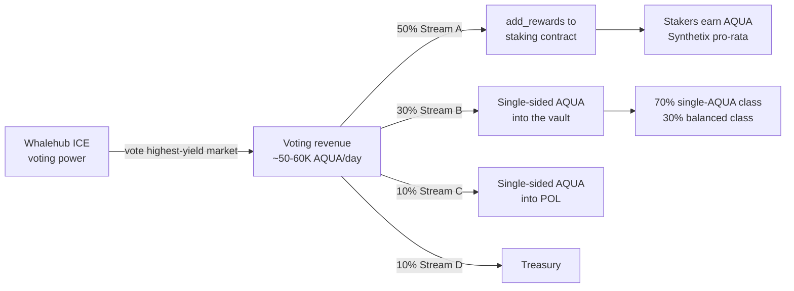

# Bribes Harvesting Module (v2)

The **Bribes Harvesting Module** is Whalehub's current reward engine — the source of the BLUB that stakers earn. It replaces the legacy [v1 POL pool-farming flow](reward-distribution.md#v1-pol-pool-farming-legacy) and is designed around one principle: **always harvest the highest-yielding bribes available, and pass that yield to stakers as BLUB.**

## What is a bribe?

Aquarius lets AQUA holders lock AQUA into **ICE** (non-transferable voting power) and vote for the Stellar markets they want to receive AQUA liquidity emissions. To attract votes, anyone can attach a **bribe** to a market — an on-chain incentive paid out to that market's voters, pro-rata to their share of the votes. Voting earns the bribe **without putting any funds at risk** in an AMM or order book.

Whalehub holds a large ICE position, so it earns bribes simply by voting — and those bribes become staker rewards.

## How stakers get AQUA



1. **Vote** — Whalehub casts its ICE (upvoteICE) on the market chosen by the optimizer (below).
2. **Collect** — revenue arrives in the manager wallet as plain AQUA payments, roughly daily.
3. **Split** — the batch is divided 50 / 30 / 10 / 10 across stakers, vault LPs, POL and treasury.
4. **Distribute** — the staker tranche passes straight through as AQUA and accrues to every staker pro-rata via the [Synthetix reward model](reward-distribution.md#stream-a--stakers-50). **No swap and no minting**, so rewards are non-dilutive and cost the pool nothing.

> **Changed in v3 (September 2026).** v2 swapped the staker tranche AQUA → BLUB on the Aquarius router before distributing it, which turned every reward into a buy order into a thin pool — and most recipients sold it straight back. That swap is removed. Stakers who specifically want BLUB can elect it individually and the contract swaps at claim time, at their own cost.

See [Reward Distribution](reward-distribution.md) for what each stream does with its tranche.

## Yield optimization — voting for the best yield

A bribe's headline size is **not** what determines your income. You earn your **share** of a market's bribe, and that share depends on how much voting power is already there:

```
your daily income(market)  =  bribe(market) × W / (existing_votes + W)
```

where `W` is Whalehub's voting power. A huge bribe on a heavily-voted market can pay less than a modest bribe on a lightly-voted one — and vice-versa. The module therefore evaluates **every active bribe** and picks the market with the highest expected income for our `W`, not the biggest sticker number.

**Data sources (live, public Aquarius APIs):**

| Input | Endpoint |
|-------|----------|
| Bribes per market (daily AQUA) | `bribes-api.aqua.network/api/bribes/` |
| Votes per market (`upvote_value`) | `voting-tracker.aqua.network/api/voting-snapshot/top-volume/` |
| Market → pair mapping | `marketkeys-tracker.aqua.network/api/market-keys/` |

**Tooling:** `scripts/bribe_vote_optimizer.py` joins these three feeds, backs out Whalehub's effective voting power from its current position, and ranks every bribed market by the expected daily income above. Re-run it each voting epoch (bribes reset weekly):

```
python3 scripts/bribe_vote_optimizer.py <current_daily_income_aqua>
```

The optimizer accounts for **dilution** — moving votes onto a market lowers everyone's share, so it reports the realistic post-move income, not a naive projection. Small markets with a high bribe-per-vote but a tiny total pool are correctly down-ranked, because Whalehub's own votes would dominate them and cap the absolute payout.

## Why this beats v1

- **Resilient:** not tied to any single pool's whitelist status — if one market's bribes dry up, the optimizer rotates to the next-best.
- **Higher yield:** votes are continuously steered to the most profitable market each epoch.
- **No new risk:** voting earns bribes without depositing into AMMs; BLUB is bought, not minted.

## Notes & cadence

- Bribes are distributed by Aquarius over weekly epochs and arrive ~daily. Voting has a minimum lock period, so Whalehub does not chase one-off spikes — it targets durable, repeating bribes.
- Backend service: `BribeRewardService` (collection, 50/30/20 split, swap, `add_rewards`, vault and POL deposits). Vote targeting is driven by the optimizer's output.
