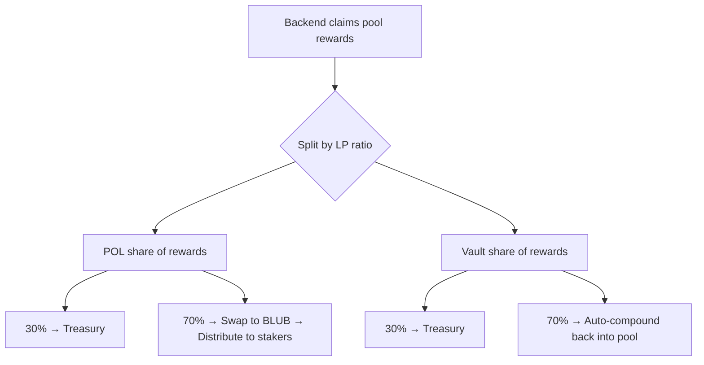

# Protocol Owned Liquidity

Protocol Owned Liquidity (POL) is liquidity that belongs to the Whalehub protocol itself, not to individual users. It generates fees and rewards that are distributed to stakers.

## How POL Is Created

When users lock AQUA, a portion is allocated to building protocol liquidity:

```
User locks 100 AQUA
├── 10 AQUA → admin wallet (for BLUB-AQUA pool deposit)
└── 10 BLUB → minted to admin wallet (paired with the AQUA above)
```

The admin wallet deposits these into the BLUB-AQUA Aquarius pool — [`CAMXZXXBD7DFBLYLHUW24U4MY37X7SU5XXT5ZVVUBXRXWLAIM7INI7G2`](https://stellar.expert/explorer/public/contract/CAMXZXXBD7DFBLYLHUW24U4MY37X7SU5XXT5ZVVUBXRXWLAIM7INI7G2) — creating LP tokens owned by the protocol.

## POL in Pool 0 (BLUB-AQUA)

The BLUB-AQUA pool contains both POL and vault user LP. The contract tracks vault user LP separately, so:

```
POL LP = Total contract LP balance - Vault user LP (tracked in contract)
```

### Rebalancing the pool (September 2026)

Pool 0 had drifted heavily to one side — roughly **98.8% BLUB** against a thin AQUA leg. A lopsided pool is a worse exit for everyone holding BLUB, because each sale moves the price further.

On 16 September the protocol burned **9,880,000 LP** of its own position to withdraw **~10,001,407 BLUB** as a single token, using `withdraw_pol_one_coin`. The BLUB was moved into the staking contract. Nothing was sold and nothing left the protocol.

Two things worth being precise about:

- **Why this direction is cheap.** Removing the *abundant* leg of a StableSwap pool costs almost nothing in imbalance fees — the quote held at ~1.012 BLUB per LP even at that size. Removing the scarce leg would have been punitive.
- **Arbitrage took back part of the gain.** The intended move was 1.16% → 2.60% AQUA. What was realised was **1.16% → 1.91%**, because traders immediately sold BLUB into the repriced pool and took roughly 55,500 AQUA out. On a pool this thin, a single large move is partly arbitraged away; smaller tranches give less to work with.

Protocol-owned LP remaining after the withdrawal was ~3.3M, still well above the vault credit the solvency guard protects.

> **Note (2026-06):** the BLUB-AQUA pool is awaiting whitelist approval from the Aquarius team. Until that approval lands, the pool earns 0 AQUA emissions, so POL earnings and the staker distribution described below are temporarily paused. The POL position itself remains intact; distribution resumes automatically when the pool is re-whitelisted.

## How POL Earnings Are Distributed



## What POL Provides

- **Permanent liquidity** — unlike user LP, POL is never withdrawn
- **Price stability** — deeper liquidity means lower slippage for BLUB trades
- **Sustainable yield** — POL earnings fund ongoing staker rewards
- **Protocol resilience** — liquidity remains even if individual users withdraw

## POL Dashboard

The frontend displays real-time POL metrics:
- Total POL in AQUA and BLUB
- POL USD value
- POL share of the total pool
- Pool APY and compounded APY
