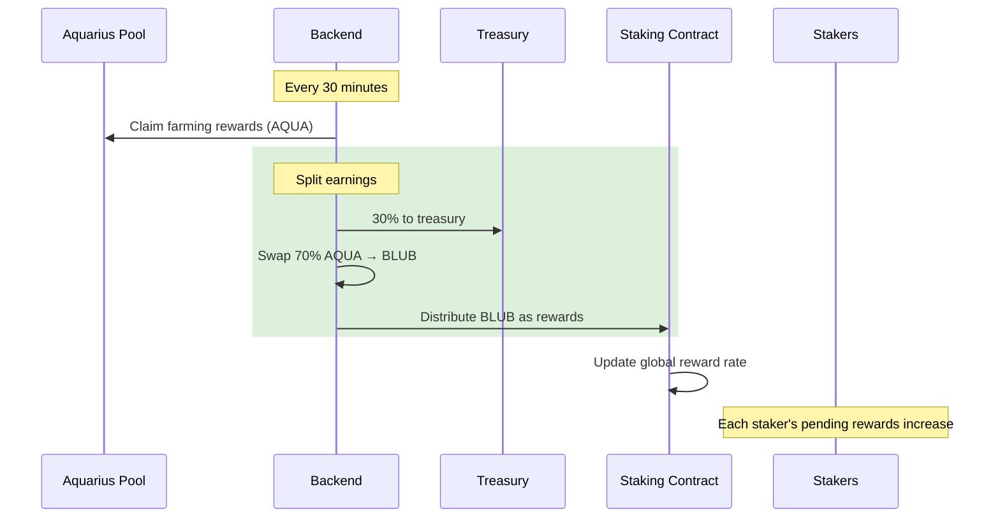
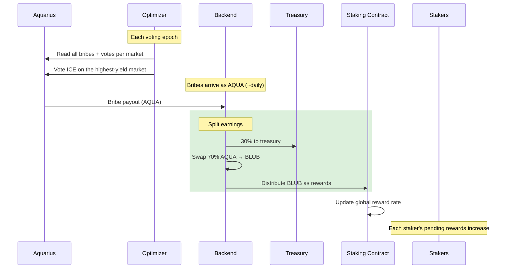

# Reward Distribution

Whalehub distributes rewards using the **Synthetix reward model** — a proven approach where rewards are split proportionally based on each user's share of the staking pool. Stakers always receive their yield as **BLUB**, regardless of where the underlying income comes from.

What has evolved is the **source** of that income. The reward engine has gone through two generations:

| Version | Reward source | Status |
|---------|---------------|--------|
| **v1** | POL pool farming (BLUB-AQUA AMM rewards) | Legacy — superseded |
| **v2** | [**Bribes Harvesting Module**](#v2-bribes-harvesting-module-current) | **Active** |

In both versions the staker-facing mechanics are identical: income is collected, a 30% treasury fee is taken, the remaining 70% is swapped to BLUB on the open market (never minted — so it is **non-dilutive**), and that BLUB is distributed through the Synthetix rate model below.

---

## v1 — POL Pool Farming (legacy)

The original design earned AQUA by farming Whalehub's protocol-owned liquidity (POL) in the BLUB-AQUA Aquarius pool, then converted it to BLUB for stakers.



This leg depended on the BLUB-AQUA pool being whitelisted for Aquarius emissions. When the pool was de-whitelisted (mid-2026), it stopped emitting AQUA — so Whalehub replaced this income stream with the **Bribes Harvesting Module** below, which now drives staker rewards.

---

## v2 — Bribes Harvesting Module (current)

Instead of relying on a single pool's emissions, Whalehub puts its locked **ICE voting power** to work and **harvests Aquarius bribes** — on-chain incentives that anyone can offer to reward voters of a given Stellar market. Whalehub votes, collects the bribes, and routes them to stakers as BLUB.

> **We optimize for the best yield.** Whalehub does not vote blindly. The protocol continuously scans **every active bribe across all Aquarius markets** and directs its votes to the pair that produces the **highest expected bribe income for our voting power** — accounting for how much voting power is already on each market (your share, not just the headline bribe size). See [Bribes Harvesting Module](bribes-harvesting.md) for the full methodology.



The treasury split, the AQUA→BLUB swap, and the Synthetix distribution are the **same** as v1 — only the income source changed (from pool farming to optimized bribe harvesting).

---

## The Math

When the protocol distributes `R` BLUB and `T` BLUB is currently staked:

```
Global rate increases by:  R / T

Your earned rewards:       Your staked BLUB × (Current rate - Your last checkpoint rate)
```

This means:
- If you hold **1%** of total staked BLUB, you earn **1%** of every distribution
- Your rewards accumulate automatically — no action needed until claiming
- The rate checkpoint updates whenever you lock, unstake, or claim

## Distribution Frequency

| Action | Frequency |
|--------|-----------|
| Vote optimization (target market) | Each voting epoch (weekly) |
| Bribe collection (AQUA) | As bribes arrive (~daily) |
| Treasury split (30%) | Per distribution |
| Staker distribution (70%) | Per distribution |
| User claiming | Every 7 days (minimum) |

## Fee Structure

| Fee | Amount | Destination |
|-----|--------|-------------|
| Treasury fee | 30% of harvested income | Protocol treasury |
| Staker share | 70% of harvested income | Distributed as BLUB |
| Staking fee | None | — |
| Claiming fee | None (only gas) | — |
| Unstaking fee | None (only gas) | — |
