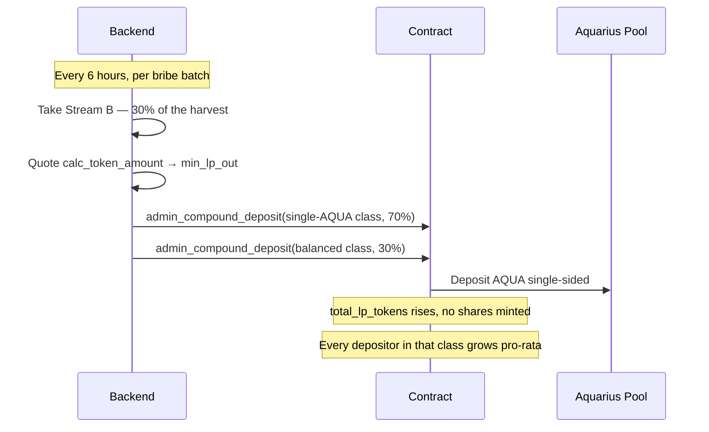
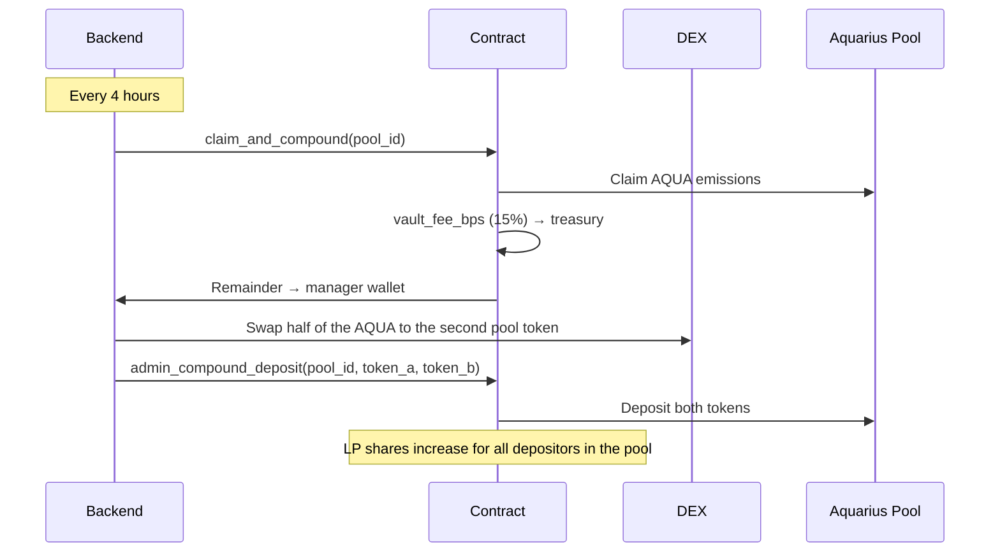

# Auto-Compounding

Whalehub's backend compounds vault rewards automatically, so a depositor never claims, swaps, or re-deposits anything by hand.

## Cadence

| Vault | Compounds per day | Driven by |
|---|---:|---|
| BLUB-AQUA | 4 | Stream B of the bribe harvest, every 6 hours |
| Other vault pools | 6 | `claim_and_compound`, every 4 hours |

Compounding returns are effectively flat above roughly 4 cycles a day — the gap between 6× and 24× daily is under 0.1% APY at any realistic rate — so the cadence is set by gas cost, not by yield.

## How it works

### BLUB-AQUA

This pool has been de-whitelisted by Aquarius since mid-2026 and emits no AQUA of its own, so its growth comes from the bribe harvest instead.

The tranche is deposited as **AQUA only**, never half-swapped into BLUB — AQUA is the scarce leg of the pool, so adding it mints more LP per unit of value and pushes the pool toward par. Deposits carry a live `min_lp_out` floor so they cannot be sandwiched.

### Other vault pools

## Reward classes in the BLUB-AQUA vault

Stream B is not shared evenly. Depositors who entered with **AQUA only** take 70% of it; depositors who entered with **both tokens** share the remaining 30%. The two classes are separate buckets over the same Aquarius pool, so each one's LP grows independently.

Single-sided **BLUB** deposits are disabled: they push the pool further off ratio, which is the opposite of what it needs.

## Compound effect

| Base Pool APY | Compounded APY | Extra yield |
|---|---|---|
| 10% | 10.5% | +0.5% |
| 25% | 28.4% | +3.4% |
| 50% | 64.8% | +14.8% |
| 100% | 171.5% | +71.5% |

## Tracking your gains

The vault interface shows:

- **Your LP tokens** — current position size
- **Deposit amount** — what you originally put in
- **Compound gains** — how much the position has grown from auto-compounding
