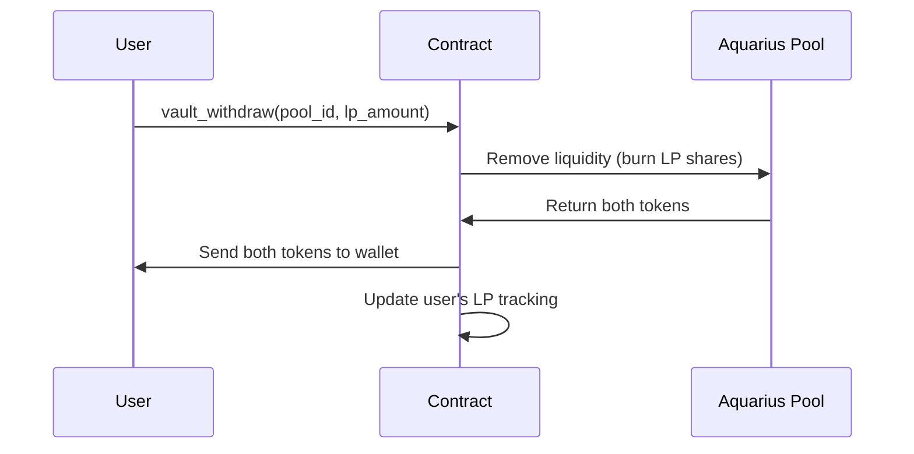

# Withdrawing from Vaults

Unlike staking, vault positions have **no lock period**. You can withdraw your liquidity at any time.

## How to Withdraw

1. Navigate to the **Liquidity Vaults** section
2. Switch to the **Withdraw** tab
3. Enter the amount of LP tokens to withdraw (or click Max)
4. Set your slippage tolerance
5. Click **Withdraw** and confirm in your wallet

## What Happens On-Chain

## What You Receive

You choose. Two exits are available.

### Both tokens (default)

You receive **both tokens** of the pool pair in the current ratio. This may differ from your original deposit ratio due to:

- **Pool ratio changes** — the token proportions shift as trades occur
- **Compound growth** — auto-compounding increases your total position
- **Impermanent loss** — if token prices diverged significantly since deposit

This is the cheaper exit. Burning LP for both legs pro-rata leaves the pool ratio exactly where it was, so the pool charges nothing extra for it.

### A single token

Since September 2026 you can instead take your whole position out as **one** token. If you entered the vault with AQUA only, this is the matching exit — otherwise you leave holding BLUB you never wanted and have to sell it.

The trade-off is real and worth understanding before choosing it. Taking one leg out of a balanced pool pushes that pool off balance, and a StableSwap pool charges an **imbalance fee** for the privilege. The fee grows with the size of your withdrawal relative to the pool, and it is largest when you take out the **scarce** token.

Two protections apply:

- The amount shown before you confirm is an **upper bound**, quoted before the imbalance fee — not a promise.
- Your slippage tolerance sets a hard floor. If the pool cannot fill at or above it, the withdrawal **reverts** rather than filling badly. You pay gas, not a bad price.

If you are unsure, take both tokens. The single-token exit exists for people who specifically want one asset and accept paying for the convenience.

## Fees

- **No protocol withdrawal fee** — you receive 100% of your LP position value
- The vault fee applies only to compounding rewards, not withdrawals
- A **single-token** withdrawal pays the pool's imbalance fee, which goes to the pool's liquidity providers, not to Whalehub
